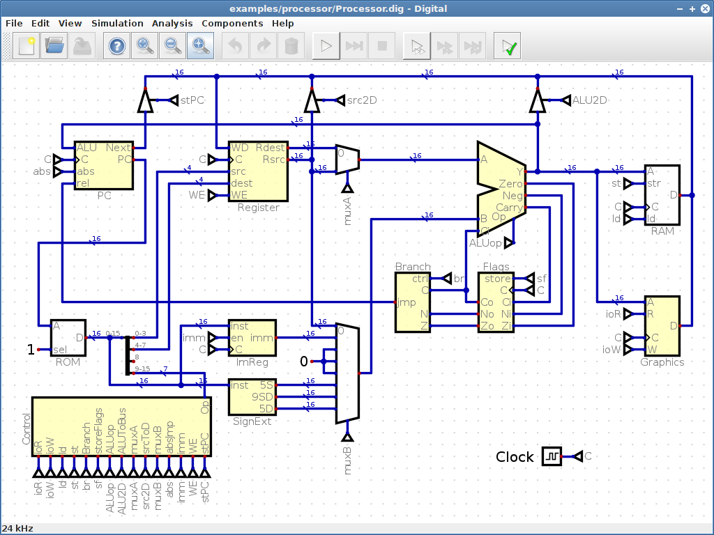
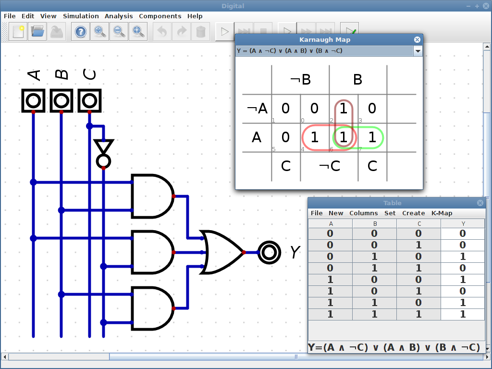

[](https://github.com/miquelt9/Digital/releases/latest/download/Digital.zip)


[](https://codecov.io/gh/miquelt9/Digital)

# Digital #

Digital is an easy-to-use digital logic designer and circuit simulator designed for educational purposes.





## [Download](https://github.com/miquelt9/Digital/releases/latest/download/Digital.zip) and Installation ##

There is no installation required, just unpack the *Digital.zip* file, which is available
for [download](https://github.com/miquelt9/Digital/releases/latest/download/Digital.zip). On Linux start the shell
script and on Windows and MacOS the JAR file can be started directly. A Java Runtime Environment (at least JRE 8) is
required to run Digital. On Windows the easiest way to get Java is to install the binaries provided by the
[Eclipse Temurin](https://adoptium.net/) project.

If there are any problems starting Digital on your system, please try to run Digital from a command line within the
*Digital* folder:

```
java -jar Digital.jar
```

## Features ##

These are the main features of Digital:

- Jutge.org features!
- Visualization of signal states with measurement graphs.
- Single gate mode to analyze oscillations.
- Analysis and synthesis of combinatorial and sequential circuits.
- Simple testing of circuits: You can create test cases and execute them to verify your design.
- Many examples: From a transmission gate D-flip-flop to a complete (simple) MIPS-like single cycle CPU.
- Includes a simple editor for finite state machines (FSM). A FSM can then be converted to a state transition table and a circuit implementing the FSM (See [screenshot](#additional-screenshots)).
- Contains a library with the most commonly used 74xx series integrated circuits.
- Supports generic circuits. This allows the creation of circuits that can be parameterized when used. In this way, it is possible, for e.g., to create a barrel shifter with a selectable bit width.
- Good performance: The example processor can be clocked at 120 kHz.
- Supports large circuits: The "Conway's Game of Life" example consists of about 2400 active components and works just fine.
- It is possible to use custom components which are implemented in Java and packed in a jar file. See this [example](https://github.com/hneeman/digitalCustomComponents) for details.   
- Simple remote [TCP interface](https://github.com/hneeman/Assembler/blob/master/src/main/java/de/neemann/assembler/gui/RemoteInterface.java)
  which e.g. allows an [assembler IDE](https://github.com/hneeman/Assembler) to control the simulator.
- Components can be described using VHDL or Verilog. The open source VHDL simulator [ghdl](http://ghdl.free.fr/)
  needs to be installed to simulate a VHDL defined component, and the open source Verilog simulator
  [Icarus Verilog](http://iverilog.icarus.com/) is required to simulate a Verilog defined component.
- A circuit can be exported to VHDL or Verilog. There is also direct support for the
  [BASYS3 Board](https://reference.digilentinc.com/reference/programmable-logic/basys-3/start) and the
  [TinyFPGA BX](https://tinyfpga.com/) board. See the documentation for details. The examples folder contains a variant of the example CPU, which runs on a BASYS3 board.
- Direct export of JEDEC files which you can flash to a [GAL16v8](https://www.microchip.com/wwwproducts/en/ATF16V8C)
  or a [GAL22v10](https://www.microchip.com/wwwproducts/en/ATF22V10C). These chips are somewhat outdated (introduced in 1985!)
  but sufficient for beginners exercises, easy to understand and well documented. Also the
  [ATF150x](https://www.microchip.com/design-centers/programmable-logic/spld-cpld/cpld-atf15xx-family) chips are
  supported which offer up to 128 macro-cells and in system programming. See the [documentation](https://github.com/miquelt9/Digital/releases/latest) for details.
- SVG export of circuits, including a LaTeX/Inkscape compatible SVG version (see
  [ctan](https://www.ctan.org/tex-archive/info/svg-inkscape))
- No legacy code.
- Good test coverage (about 80%; Neither the GUI tests nor the HDL simulator integration tests are running on the
  Travis-CI build servers, so CodeCov measures only about 50%). Almost all examples contain test cases which ensure that they work correctly.

The latest changes that have not yet been released are listed in the
[release notes](distribution/ReleaseNotes.txt).
You can find the latest pre-release builds [here](https://infdigital.dhbw-mosbach.de/). 
In the pre release builds the automated GUI tests are usually not executed. 
All other tests, including the HDL tests, were executed without errors.

## Documentation ##

The [documentation](https://github.com/miquelt9/Digital/releases/latest) is available in English, German, Spanish,
Portuguese, French, Italian and simplified Chinese. It is still very incomplete but it contains a chapter "First Steps"
which explains the basic usage of Digital. The documentation also contains a list of available 74xx chips and a list of
available keyboard shortcuts.

## Comments ##

If you want to send a bug report or feature request please use the GitHub
[issue tracker](https://github.com/miquelt9/Digital/issues/new). This helps me to improve Digital, so do not hesitate.
If you have general questions, you can also use the new
GitHub [Discussions](https://github.com/miquelt9/Digital/discussions)
to ask your questions without creating an issue.

## Motivation ##

This fork of [Digital](https://github.com/hneemann/Digital) has an extension that allows users to send their circuit design to [Jutge.org](https://www.jutge.org) where multiple problems related to circuits are available to solve. This is a part of my thesis regarding the implementation of a automated correction system for Verilog.

## Credits ##

Many thanks to the following persons for making Digital possible:

* Ivan de Jesus Deras Tabora from the Universidad Tecnológica Centroamericana in Honduras has implemented the verilog code generator and almost all the necessary verilog templates.
* Theldo Cruz Franqueira from the Pontifícia Universidade Católica de Minas Gerais in Brazil has provided the Portuguese translation.
* Ángel Millán from the Instituto de Educación Secundaria Ies Virgen de Villadiego in Peñaflor (Sevilla), Spain has provided the Spanish translation.
* XinJun Ma ([@itviewer](https://github.com/itviewer)) has provided the Chinese translation.
* Nicolas Maltais ([@maltaisn](https://github.com/maltaisn)) has provided the French translation.
* Luca Cavallari ([@psiwray](https://github.com/psiwray)) has provided the Italian translation.
