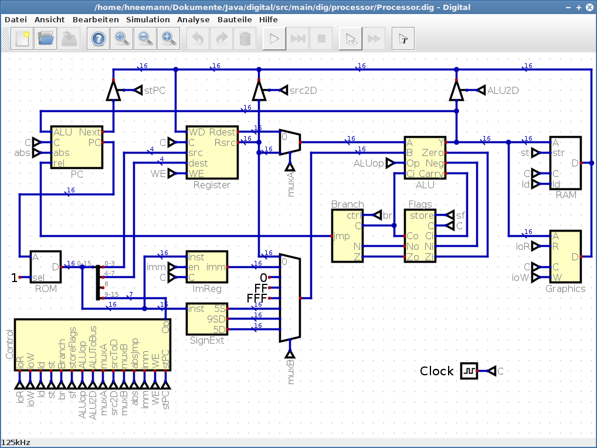
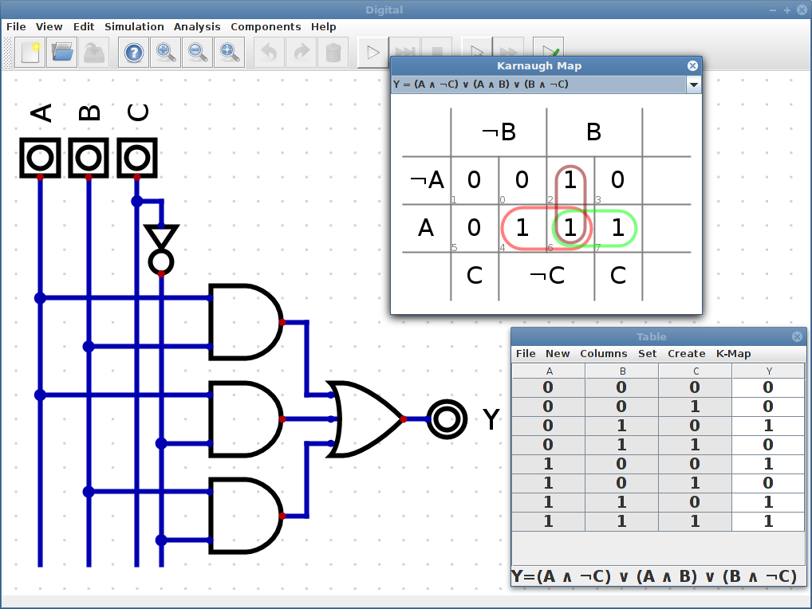

[Download latest Release](https://github.com/hneemann/Digital/releases/latest)

The most recent changes are listed in the [release notes](distribution/ReleaseNotes.txt).

# Digital #

Digital is an easy-to-use digital circuit simulator. 
It's designed for educational purposes, and I use it in my lectures to illustrate digital electronics.

## Features ##

These are the main features of Digital:

- Visualization of signal states with measurement graphs.
- Single gate mode to analyze oscillations.
- Analysis and synthesis of combinatorial and sequential circuits.
- Simple testing of circuits: You can create test cases and execute them to verify your design.
- Many examples: From a transmission gate D-flip-flop to a complete (simple) MIPS-like single cycle CPU.
- Contains a library with the most commonly used 74xx series integrated circuits. 
- Good performance: The example processor can be clocked at 120 kHz.
- Supports large circuits: The "Conway's Game of Life" example consists of about 2400 active components
  and works just fine.
- It is possible to use custom components which are implemented in Java and packed in a jar file. 
  See this [example](https://github.com/hneemann/digitalCustomComponents) for details.   
- Simple remote TCP interface which e.g. allows an [assembler IDE](https://github.com/hneemann/Assembler) to control 
  the simulator.
- Components can be described using VHDL. The open source VHDL simulator [ghdl](http://ghdl.free.fr/) is required to
  simulate a VHDL defined component. The ghdl source code is also available at [GitHub](https://github.com/ghdl/ghdl).  
- Export to VHDL: A circuit can be exported to VHDL. There is also support for the
  [BASYS3 Board](https://reference.digilentinc.com/reference/programmable-logic/basys-3/start). See the documentation 
  for details. The examples folder contains a variant of the example CPU, which runs on a BASYS3 board.
- Components can be described using Verilog. The open source Verilog simulator [Icarus Verilog](http://iverilog.icarus.com/) is required to
  simulate a Verilog defined component. The Icarus Verilog source code is also available at [GitHub](https://github.com/steveicarus/iverilog).
- Exporting a circuit to Verilog is also possible. Special thanks to Ivan de Jesus Deras Tabora, who has
  implemented the Verilog code generator and all the necessary Verilog templates!
- Direct export of JEDEC files which you can flash to a [GAL16v8](https://www.microchip.com/wwwproducts/en/ATF16V8C)
  or a [GAL22v10](https://www.microchip.com/wwwproducts/en/ATF22V10C). These chips are somewhat outdated (introduced in 1985!) 
  but sufficient for beginners exercises, easy to understand and well documented. Also the
  [ATF150x](https://www.microchip.com/design-centers/programmable-logic/spld-cpld/cpld-atf15xx-family) chips are 
  supported which offer up to 128 macro-cells and in system programming. See the documentation for details.
- SVG export of circuits, including a LaTeX/Inkscape compatible SVG version (see 
  [ctan](https://www.ctan.org/tex-archive/info/svg-inkscape))
- No legacy code.
- Good test coverage (about 80%; The GUI tests are not running on the headless Travis-CI servers, so CodeCov measures only about 50%).
  Almost all examples contain test cases which ensure that they work correctly.

## Documentation ##

The [documentation](https://github.com/hneemann/Digital/releases/latest) is available in English and German.
It is still very incomplete but it contains a chapter "First Steps" which explains the basic usage of Digital.
The documentation also contains a list of available 74xx chips and a list of available keyboard shortcuts. 

## Comments ##

If you want to send a bug report or feature request please use the GitHub 
[issue tracker](https://github.com/hneemann/Digital/issues/new). 
This helps me to improve Digital, so do not hesitate.

It's also possible to send a private message to [digital-simulator@web.de](mailto:digital-simulator@web.de).

## Motivation ##

Prior to the development of Digital, I used [Logisim](http://www.cburch.com/logisim/), developed by Carl Burch.
If you are familiar with Logisim you will recognize the wire color scheme.

Logisim is a excellent and proven tool for teaching purposes, that has been actively developed until 2011. 
In 2013 Carl Burch has started the development of a new simulator called [Toves](http://www.toves.org/). 
In his [blog](http://www.toves.org/blog/) he explained why he decided to develop a new simulator instead of improving Logisim. 
In short: There are weaknesses in Logisims architecture which are too difficult to overcome.
Unfortunately, the development of Toves was discontinued at a very early stage.

In 2014, Carl Burch finally [discontinued](http://www.cburch.com/logisim/retire-note.html) the development of
Logisim. Since Logisim was released as open source, there are a number of forks to continue the work on Logisim:

- [Logisim-Evolution](https://github.com/reds-heig/logisim-evolution) by people of a group of swiss institutes (Haute École Spécialisée Bernoise, Haute École du paysage, d'ingénierie et d'architecture de Genève, and Haute École d'Ingénierie et de Gestion du Canton de Vaud)
- [Logisim](https://github.com/lawrancej/logisim) by Joseph Lawrance at Wentworth Institute of Technology, Boston, MA 
- [Logisim-iitd](https://code.google.com/archive/p/logisim-iitd/) from the Indian Institute of Technology Delhi
- [Logisim](http://www.cs.cornell.edu/courses/cs3410/2015sp/) from the CS3410 course of the Cornell University

But as far as I know, these projects do not work on solving the architectural difficulties. 
They are more about adding features and fixing bugs. In [Logisim-Evolution](https://github.com/reds-heig/logisim-evolution), 
for example, a VHDL/Verilog export was added.

So I also decided to implement a new simulator completely from scratch and started the implementation of Digital in march 2016.
In the meantime a development level has been reached which is comparable to Logisim.
In some areas (performance, testing of circuits, circuit analysis, hardware support) Logisim has already been exceeded.

Below I would like to explain briefly the reasons which led me to start a new development:

### Switch On ###

In Logisim there is no real "switching on" of a circuit. The simulation is running also while you are modifying it. 
This causes sometimes an unexpected behaviour. So it is possible to build a simple master-slave flip-flop
which works fine. But after a circuit reset the flip-flop does not work anymore.  
Since the circuit is not switched on, there is no
settling time to bring the circuit to a stable condition after its completion.
A master-slave JK-flip-flop can only be implemented with a reset input, and this
reset input needs to be activated to make the circuit operational.

To understand how Digital deals with this issue, you have to look at how the simulation works in Digital:
Digital uses an event based simulator approach, i.e. each time a 
gate undergoes a change at one of its inputs, the new input states are read, however, 
the outputs of the gate are not updated instantly. Only when all gates involved have read their inputs, 
the outputs of all gates are updated. All gates seem to change synchronously, i.e.
they seem to have all the exact same gate delay time.
However, an undesirable feature of this approach is that even a simple RS flip-flop might not be able to 
reach a stable state. The same problem Logisim has.

To solve that problem, the "switching on" is introduced and a different simulation mode is used during the
settling time right after switching on the circuit:  
Each time a gate undergoes a change at one of its inputs all gate inputs are read and their outputs are updated immediately.
This happens gatewise in random order until no further changes occur and the circuit reaches a stable state.
The gates appear to have random delay times now.
This way, a master-slave flip-flop reaches a stable state after "switch on", however, the final state is still undefined.

To start a circuit in a defined state a special reset gate is used.
This gate has a single output which is low during settling time and goes 
high when settling time is over.

A disadvantage of this approach is the fact that a running simulation cannot be changed.
In order to do so, the circuit needs be switched off, modified and switched on again.
However, this procedure is also advisable for real circuits.

### Oscillations ###

With Logisim it is hard to find the root cause for oscillating circuits. If Logisim detects an oscillation,
a corresponding message is issued, but it is not possible to investigate the cause in more detail, so it is difficult to
understand what happens.

The synchronous update of all gates, which have seen a change at one of their inputs may also cause
oscillations in Digital. In such a case, the oscillation is detected and simulation stops.
However, there is also a single gate mode which allows to propagate a signal change gate by gate. This feature allows to
follow the way through the circuit. After each step, all gates with a change at one
of their inputs are highlighted.
This way you can see how a signal change propagates in a circuit, thus you are able to find the root cause of an oscillation.

### Embedded circuits ###

Similar to Logisim, Digital also allows to embed previously saved circuits in new designs, so hierarchical
circuits can be created. However, in Digital embedded circuits are included as often as 
the circuit is used. This is similar to a C program in which all 
function calls are compiled as inlined functions. And this is also similar to a real circuit: 
Each sub circuit is "physically present" as often as it is used in the design. 
Although this approach increases the size of the data structure of the simulation model in memory, 
it simplifies the simulation itself.
Thus, for example, the inputs and outputs of an embedded circuit are not specifically treat, they simply don't 
exist anymore after the formation of the simulation model. Even bidirectional connections can be implemented easily.
Because of that approach for instance a embedded AND gate in a sub circuit behaves exactly like an AND gate 
inserted at top level although there is actually no difference between these two variants from the 
simulation models perspective.
Logisim works somewhat different, which sometimes leads to surprises like unexpected signal propagation times and
which makes it difficult to use bidirectional pins. 

### Performance ###

If a complete processor is simulated, it is possible to calculate the simulation without an update of the 
graphical representation.
A simple processor (see example) can be simulated with a 120kHz clock (Intel® Core ™ i5-3230M CPU @ 2.60GHz),
which is suitable also for more complex assembly exercises like Conway's Game of Live.
There is a break gate having a single input. If this input changes from low to high this quick run is stopped.
This way, an assembler instruction BRK can be implemented, which then can be used to insert break points
in assembly language programs. So the debugging of assembly programs becomes very simple.

### Debugging ###

In Logisim there is no easy way to debug an assembly program in a simulated processor.
Digital offers a simple TCP-based remote control interface, so an [assembler IDE](https://github.com/hneemann/Assembler) 
can be used to control the simulator and load assembly programs into the simulated processor, start the program, perform 
single steps and so on. If a "single step" or a "run to next BRK instruction" is triggered by the assembly IDE, the
actual used address of the program memory is returned to the assembler IDE. 
This allows the assembler IDE to highlight the actual executed instruction. In this way it is very easy to debug an 
assembly program executed by a simulated processor.

### Circuit Synthesis ###

Logisim is able to generate combinatorial circuits from a truth table and vice versa. In Digital, this is also possible.
In addition, also a sequential circuit can be generated from an appropriate state transition table.
You can specify both the transition circuit and the output circuit. The minimization of the expressions is done
by the method of Quine and McCluskey.
The truth table also can derived from a circuit which contains simple combinatorial logic,
D flip-flops or JK flip-flops, including the generation of the state transition table.
Note, however, that a flip-flop build of combinatorial gates is not recognized as such.
The analysis of sequential circuits only works with purely combinatorial
logic combined with the build-in D or JK flip-flops.
After you have created the truth table or state transition table you can create a JEDEC file for a 
[GAL16v8](http://www.atmel.com/devices/ATF16V8C.aspx) or a [GAL22v10](http://www.atmel.com/devices/ATF22V10C.aspx).
After that you can simply flash this file to the appropriate GAL and test the circuit on a bred board.
As mentioned above these GALs are quite old but with 8/10 macro-cells sufficient for beginners exercises.
If more macro-cells are required, see the PDF documentation that is included in the distribution for details 
on how to set up Digital to support the [ATF1502](http://www.microchip.com/wwwproducts/en/ATF1502AS) and
[ATF1504](http://www.microchip.com/wwwproducts/en/ATF1504AS) which offer 32/64 macro-cells and ISP (In System Programming).  

## How do I get set up? ##

The easiest way is to download the [latest release](https://github.com/hneemann/Digital/releases/latest). 
In the ZIP file you will find the binary (Digital.jar) and all examples. A Java JRE 1.8 is needed to run Digital.

If you want to build Digital from the source code:
 
* At first clone the repository.
* JDK 1.8 is needed (either the Oracle JDK 1.8 or OpenJDK 1.8)  
* maven is used as build system, so the easiest way is to install [maven](https://maven.apache.org/).
* After that you can simply run `mvn install` to build Digital.
* Run `mvn site` to create a findbugs and a cobertura code coverage report.
* Most IDEs (Eclipse, NetBeans, IntelliJ) are able to import the `pom.xml` to create a project.

## Contribution guidelines ##

* If you want to contribute, please open a GitHub issue first.
  * A discussion should avoid duplicate or unnecessary work.  
  * Before you send a pull request, make sure that at least `mvn install` runs without errors.
* Don't introduce new findbugs issues.
* Try to keep the test coverage high. The target is a minimum of 80% test coverage.
* So far, there are only a few GUI tests, so that the overall test coverage is only slightly below 80%.
  Try to keep the amount of untested GUI code low.
